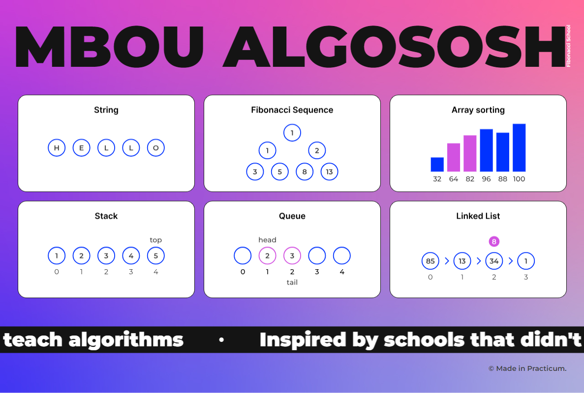

# Project - Algorithm Visualizer

The project work involves the development of an algorithm visualizer. This project focuses on animating and step-by-step displaying the algorithm's operation.

The design was prepared by Yandex.Praktikum. Additionally, a project template is provided, consisting of a landing page and separate pages for algorithm visualization, as well as some UI components.

Algorithms were tested using Jest and Cypress.

**MBOU ALGOSOSH -** *Municipal Budget Educational Institution Algorithmic Shift School.*



## Tech Stack

React, JavaScript, CSS, JSX, TypeScript, Jest, Cypress.

# DESCRIPTION

## String

Here's an algorithm for reversing a string.

After entering text in the input field and clicking the "Reverse" button, a word appears on the screen, with its letters written in blue circles.

Two candidates for sorting are highlighted in purple. The already sorted elements are colored green. To avoid interrupting the ongoing animation, a loader has been added to the button.

The animation is performed smoothly with a 1000 ms interval.


## Fibonacci Sequence

On this screen, the generation of `n` numbers of the Fibonacci sequence is presented. For example, if you enter 4, the sequence 1, 1, 2, 3, 5 will appear on the screen. Input is limited to positive integers since the sequence is infinite. The maximum input limit is set to 1 ? n ? 19.

The elements are displayed gradually. First one appears, then the second, third, and so on until n. While the sequence is being displayed, a loader is placed on the button to prevent repeated clicks.

The animation is smooth with a 500 ms interval.


## Array Sorting

This screen features an algorithm visualizer for selection sort and bubble sort.

The following components are displayed on the screen:
- RadioInput for selecting the sorting method (selection or bubble). The default value is set to "Selection".
- "Descending" button: When clicked, the array elements are sorted in descending order, using the sorting algorithm specified in the RadioInput.
- "Ascending" button: When clicked, the array elements are sorted in ascending order, using the sorting algorithm specified in the RadioInput.
- "New Array" button: When clicked, the randomArr function generates a new array.

When you click "Descending" or "Ascending", the sorting process starts based on the selected method: selection or bubble.

Two colors are used for sorting animation:
- Purple: Elements being sorted.
- Green: Sorted array elements.

The active button has a loader and all other controls are disabled while the sorting animation is in progress.

The array sorting is performed smoothly with a 1000 ms interval.


## Stack

This screen features a visualizer for adding and removing elements from the stack data structure.

The page includes the following components:
- An input field for entering values to be added to the stack.
- "Add" button: When clicked, it calls the push(item) method of the stack.
- "Remove" button: When clicked, it calls the pop() method of the stack.
- "Clear" button: To remove all elements from the stack at once.

Initially, the stack is empty.

If you enter a value in the input field and **click "Add",** the first element appears in the stack and is displayed on the page. The entered value is written inside a circle, with the stack's top pointer shown above the component, and the element's index number displayed below (starting from 0 for the first element and so on). The input field is cleared after adding an element to the stack. When adding another element, a new circle with the new value and index 1 should appear to the right of the previous one. The "top" label will appear above it. The new element briefly highlights in purple when added. If there is no number in the input field, clicking the "Add" button will not invoke the push(item) method. **Clicking "Remove"** removes only the top element from the stack. The removed element is highlighted, and the "top" label moves to its left neighbor. If there is only one element in the stack, no elements will be displayed on the page after clicking "Remove". **Clicking the "Clear"** button removes all elements from the stack at once.

When a button is clicked, a loader appears on it, and other controls are disabled. The input is limited to four characters; otherwise, the value will look odd in the Circle component.

All animations on the page are performed smoothly with a 500 ms interval.


## Queue

This screen features a visualizer for adding and removing elements from the "queue" data structure.

The page includes the following components:
- An input field for entering values to be added to the queue.
- "Add" button: When clicked, it calls the enqueue(item) method of the queue.
- "Remove" button: When clicked, it calls the dequeue() method of the queue.
- "Clear" button: To remove all elements from the queue at once.

Empty elements of the queue are represented using the Circle component.
If you enter a value of 2 in the input field and **click "Add"**, the element will appear with index 0. The head and tail pointers will also be added to the element. The input field is cleared. When elements are added to the queue, the tail position shifts, and the new element briefly highlights in purple. Then the highlighting is removed, and the input field is cleared. Now, if you **click "Remove",** the element at index 0 will be dequeued from the queue (briefly highlighted in purple), and the head will be moved to the element with index 1.

All animations on the page are performed smoothly with a 500 ms interval.

When a button is clicked, a loader is displayed on it, and other controllers are disabled. The input is limited to four characters; otherwise, the value will look odd in the Circle component.


## Linked List

On this screen, you can add and remove elements from a linked list.

**To add an element:**
- An input field with the placeholder "Enter value" is provided to input the value (referred to as "value") that you want to add to the list.
- "Add to Head" button: When clicked, the value from the input field becomes the new head of the list, and the input field is cleared.
- "Add to Tail" button: When clicked, the value from the input field becomes the new tail of the list, and the input field is cleared.

**To remove an element:**
- "Remove from Head" button: When clicked, the first element is removed from the list.
- "Remove from Tail" button: When clicked, the last element is removed from the list.

**To remove or add an element by index:**
- An input field with the placeholder "Enter index" is provided to input the index of the element in the linked list.
- "Add by Index" button: When clicked, the value from the input field (referred to as "value") should be inserted at the specified index (referred to as "ind"), and the input field is cleared.
- "Remove by Index" button: When clicked, the element at the specified index (referred to as "ind") is removed from the list.

In addition to the control elements, a small linked list is displayed on the page.

When adding a new element, it is displayed above the existing list elements, and when removing an element, it is displayed below them.

All animations on the page are performed smoothly with a 500 ms interval.

The active button has a loader, and all other controls are disabled during this time. The input value is limited to four characters; otherwise, the value will look odd in the Circle component.


## Setup

You should have Node.js installed. Then, enter the following commands in the specified order:
```sh
npm i
```
```sh
npm start
```

**To run the test,** press:
```sh
npm test
```

To run **Cypress tests,** press:
```sh
npm run cypress:open
```